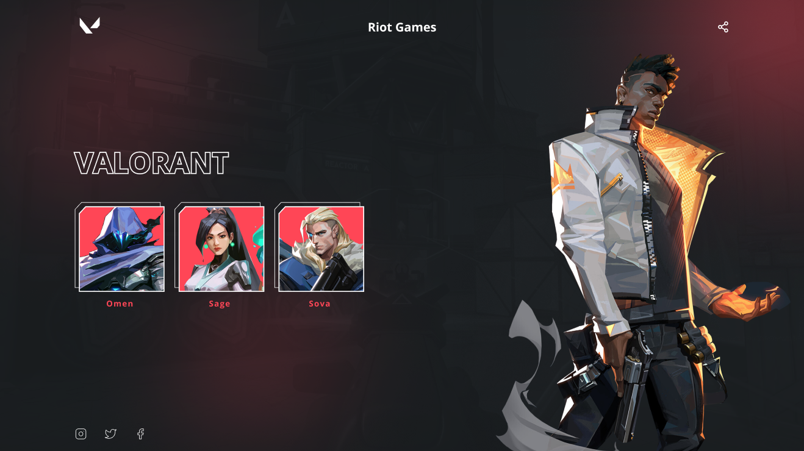
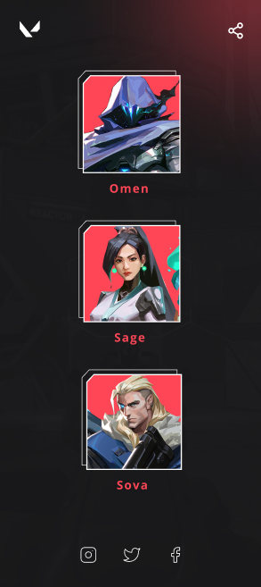

# Codelandia-Desafio-7 &copy; Rian Pacheco 🚀

### link do projeto - https://rianpacheco.github.io/Valorant/

 Projeto feito 100% para didática e colocar em pratica as tecnologias em front-end.

 Projeto feito do Desafio do Servidor Codêlandia do Iuri-Code..
 
 
Caso tenham interesse aos desafios acessem o <a href="https://www.figma.com/file/Yb9IBH56g7T1hdIyZ3BMNO/Desafios---Codel%C3%A2ndia?node-id=0%3A1">figma</a> 

## Preview Desktop 💻

## Preview Mobile 📱

# Tecnologias utilizadas 🌐

## Front end 🔆
- HTML
- CSS

## Implantação em produção
- Front end web: GitHub.Io

# Autor

&copy; <a href="https://www.linkedin.com/in/rian-pacheco/"> Rian Pacheco</a>
